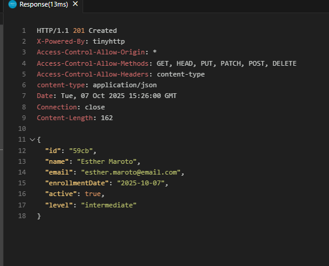
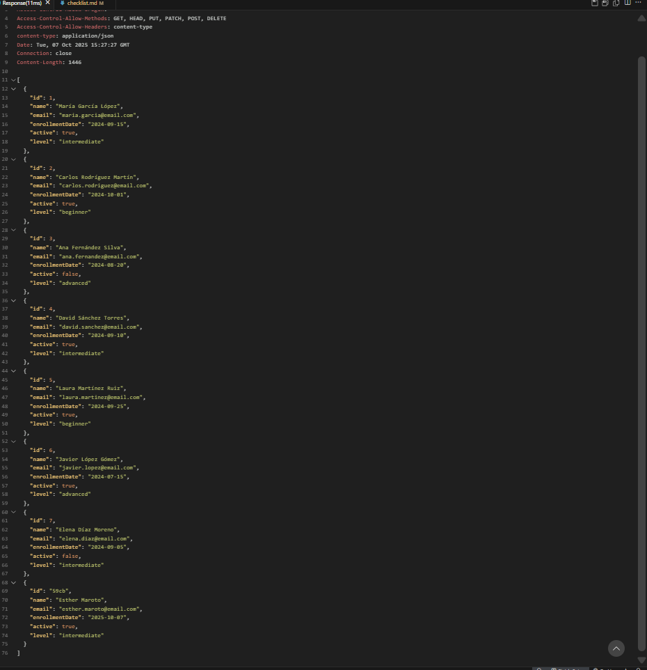
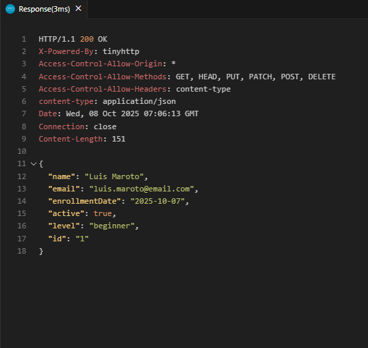
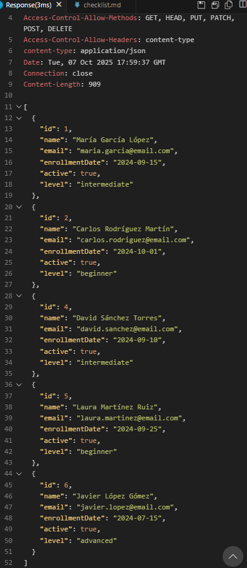
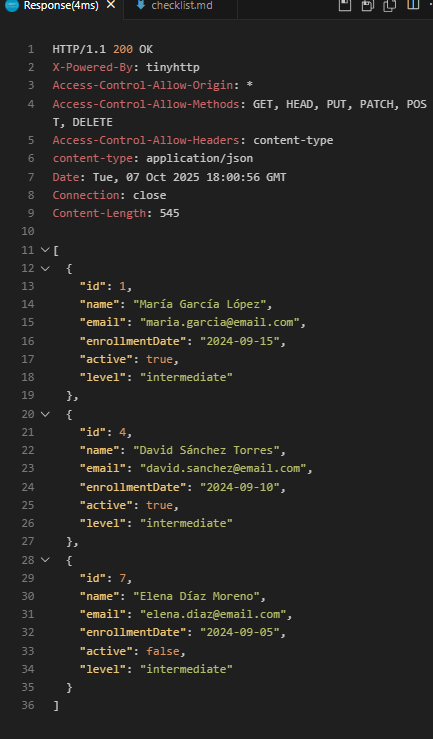
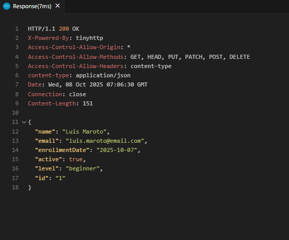
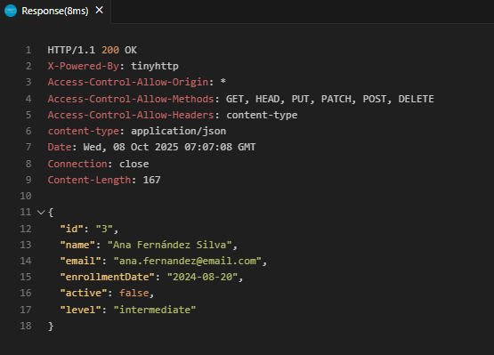
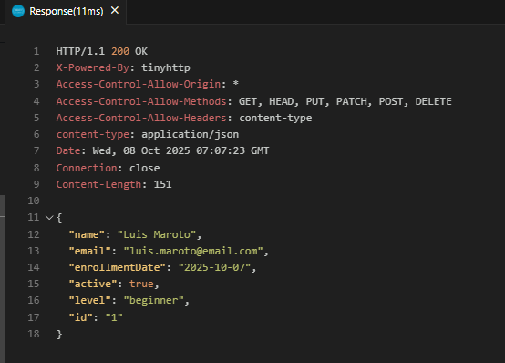

# CRUD HTTP Manual con cURL, Thunder Client y REST Client

Este proyecto implementa un sistema completo de gestión de estudiantes mediante peticiones HTTP,
 utilizando una API local con json-server. 

    -cURL (linea de comandos)
    -Thunder Client (interfaz gráfica)
    -REST Client (archivos `.http`)

## Parte 1: Configuración inicial

#### Requisitos
- Node.js v18+
- Git
- Visual Studio Code con extensiones:
  - Thunder Client
  - REST Client

#### Instalación

```bash 
npm install
npm run server:up
```
>El servidor se levanta en http://localhost:4000

## Parte 2: Script CRUD con funciones JavaScript

## Parte 3: Documentación CRUD con cURL

## Parte 4: Thunder Client

## Parte 5: REST Client
REST Client es una extensión de Visual Studio Code que permite enviar peticiones HTTP directamente desde archivos `.http`. 
En este proyecto se ha creado el archivo `peticiones-crud.http` en la raíz del proyecto para documentar y probar todas las operaciones CRUD sobre la colección `students`.

---

#### Variables definidas

```http
    @baseURL = http://localhost
    @port = 4000
    @apiUrl = {{baseURL}}:{{port}}/students
```

----

#### Operaciones CRUD

- ###### CREATE estudiante

```http
POST {{apiUrl}}
Content-Type: application/json

{
"name": "Esther Maroto",
"email": "esther.maroto@email.com",
"enrollmentDate": "2025-10-07",
"active": true,
"level": "intermediate"
}
```



- ###### READ todos

```http
GET {{apiUrl}}
```




- ###### READ por ID

```http
GET {{apiUrl}}/1
```




- ###### READ estudiantes activos

```http
GET {{apiUrl}}?active=true
```



- ###### READ por nivel

```http
GET {{apiUrl}}?level=intermediate
```




- ###### UPDATE completo (PUT)

```http
PUT {{apiUrl}}/1
Content-Type: application/json

{
  "name": "Luis Maroto",
  "email": "luis.maroto@email.com",
  "enrollmentDate": "2025-10-07",
  "active": true,
  "level": "beginner"
}
```




- ###### PATCH campo específico

```http
PATCH {{apiUrl}}/3
Content-Type: application/json

{
    "level": "intermediate"
}
```




- ###### DELETE estudiante

```http
DELETE {{apiUrl}}/1
```



## Parte 6: Script de validación


  