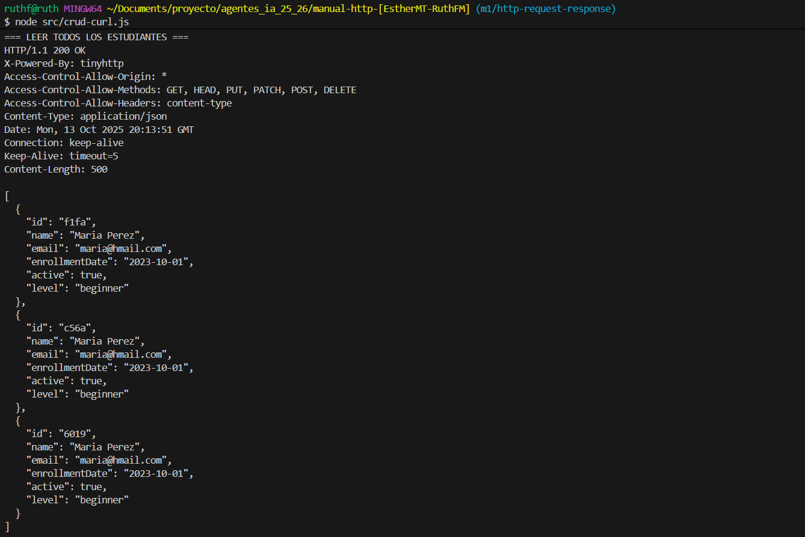
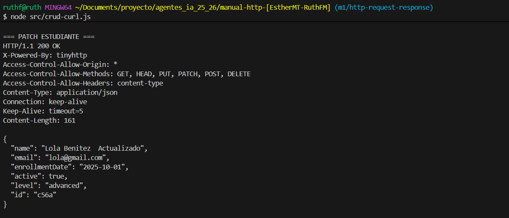

# CRUD HTTP Manual con cURL, Thunder Client y REST Client

Este proyecto implementa un sistema completo de gestión de estudiantes mediante peticiones HTTP,
 utilizando una API local con json-server. 

    -cURL (linea de comandos)
    -Thunder Client (interfaz gráfica)
    -REST Client (archivos `.http`)

## Parte 1: Configuración inicial

#### Requisitos
- Node.js v18+
- Git
- Visual Studio Code con extensiones:
  - Thunder Client
  - REST Client

#### Instalación

```bash 
npm install
npm run server:up
```
>El servidor se levanta en http://localhost:4000


## Parte 3: Documentación CRUD con cURL

### CREATE - Crear estudiante

Crea un nuevo estudiante en el sistema enviando sus datos en formato JSON.

```bash
curl -i -X POST http://localhost:4000/students \ 
-H "Content-Type: application/json" \ 
-d '{"name":"Juan Perez","email":"juan@hmail.com","enrollmentDate":"2023-10-01","active":true,"level":"beginner"}'
```

| Flag | Descripción |
|------|-------------|
| -i | Muestra los headers de la respuesta HTTP |
| -X POST | Indica el método HTTP POST |
| -H "Content-Type: application/json" | Especifica que el cuerpo de la petición está en formato JSON |
| -d | Define los datos que se envían en el cuerpo de la petición |


**Headers enviados**

- Content-Type: application/json → Indica que se envía un cuerpo en formato JSON.


**Respuesta HTTP**


**Código de estado**

- 201 Created → El recurso fue creado exitosamente.


### READ ALL - Leer todos los estudiantes

Recupera la lista de todos los estudiantes.

```bash
curl -i -X GET http://localhost:4000/students
```

| Flag | Descripción |
|------|-------------|
| -i | Muestra los headers |
| -X GET | Método HTTP para obtener datos |


**Headers enviados**

- No se requieren headers adicionales.


**Respuesta HTTP**



**Código de estado**

- 200 OK → Petición exitosa.

### READ BY ID - Leer estudiante por ID

Obtiene los datos de un estudiante específico por su ID.

```bash
curl -i -X GET http://localhost:4000/students/7
```

| Flag | Descripción |
|------|-------------|
| -i | Muestra los headers |
| -X GET | Método HTTP GET |


**Headers enviados**

- No se requieren headers adicionales.


**Respuesta HTTP**


**Código de estado**

- 200 OK → Petición exitosa.


### UPDATE - Actualizar estudiante (PUT)

Reemplaza completamente los datos de un estudiante por ID

```bash
curl -i -X PUT http://localhost:4000/students/6 \ 
-H "Content-Type: application/json" \
-d '{"name":"Maria Perez Actualizado","email":"maaa@gmail.com","enrollmentDate":"2023-10-01","active":false,"level":"intermediate"}'
```

| Flag | Descripción |
|------|-------------|
| -X PUT | Método HTTP para reemplazar completamente un recurso |


**Headers enviados**

- Content-Type: application/json


**Respuesta HTTP**


**Código de estado**

- 200 OK → Petición exitosa.


###  PATCH - Actualización parcial

Modifica parcialmente los datos de un estudiante por ID.

```bash
curl -i -X PATCH http://localhost:4000/students/6 \
-H "Content-Type: application/json" \
-d '{"level":"advanced","active":true}'     
```

| Flag | Descripción |
|------|-------------|
| -X PATCH | Método HTTP para modificar parcialmente un recurso |

**Headers enviados**

- Content-Type: application/json


**Respuesta HTTP**



**Código de estado**

- 200 OK → Petición exitosa.

###  DELETE - Eliminar estudiante

Elimina un estudiante por su ID.

```bash
curl -i -X DELETE http://localhost:4000/students/7   
```

| Flag | Descripción |
|------|-------------|
| -X DELETE | Método HTTP para eliminar un recurso |

**Headers enviados**

- No se requieren headers adicionales.


**Respuesta HTTP**


**Código de estado**

- 200 OK → Petición exitosa.

---

## Parte 4: Thunder Client

---

## Parte 5: REST Client
REST Client es una extensión de Visual Studio Code que permite enviar peticiones HTTP directamente desde archivos `.http`. 
En este proyecto se ha creado el archivo `peticiones-crud.http` en la raíz del proyecto para documentar y probar todas las operaciones CRUD sobre la colección `students`.

---

#### Variables definidas

```http
    @baseURL = http://localhost
    @port = 4000
    @apiUrl = {{baseURL}}:{{port}}/students
```

----

#### Operaciones CRUD

- ###### CREATE estudiante

```http
POST {{apiUrl}}
Content-Type: application/json

{
"name": "Esther Maroto",
"email": "esther.maroto@email.com",
"enrollmentDate": "2025-10-07",
"active": true,
"level": "intermediate"
}
```


- ###### READ todos

```http
GET {{apiUrl}}
```


- ###### READ por ID

```http
GET {{apiUrl}}/1
```


- ###### READ estudiantes activos

```http
GET {{apiUrl}}?active=true
```


- ###### READ por nivel

```http
GET {{apiUrl}}?level=intermediate
```


- ###### UPDATE completo (PUT)

```http
PUT {{apiUrl}}/1
Content-Type: application/json

{
  "name": "Luis Maroto",
  "email": "luis.maroto@email.com",
  "enrollmentDate": "2025-10-07",
  "active": true,
  "level": "beginner"
}
```


- ###### PATCH campo específico

```http
PATCH {{apiUrl}}/3
Content-Type: application/json

{
    "level": "intermediate"
}
```


- ###### DELETE estudiante

```http
DELETE {{apiUrl}}/1
```


## Parte 6: Script de validación


  